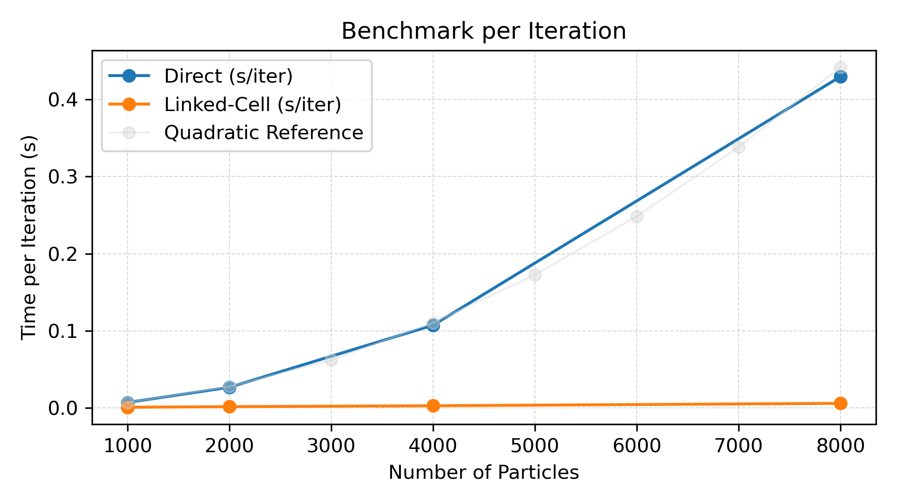
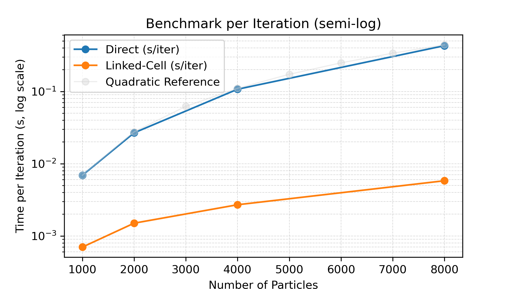

MolSim GroupB
===

## Build Instructions

### Build and run (CLI)
From the project root execute the following commands in that order:
```
mkdir build && cd build
cmake -G Ninja -DCMAKE_BUILD_TYPE=Release -DBUILD_DOC=ON -DENABLE_VTK_OUTPUT=ON -DVTK_DIR=/usr/local/vtk/lib/cmake/vtk-9.5 ..
cmake --build .
cmake --build . --target doc_doxygen
./MolSim ../input/eingabe-collision.txt 5 0.0002 file info P:OFF
```

### Run with CLion
- Open the local CMake configurations
- Edit the MolSim CMake Application:
``` 
  Target: MolSim
  Executable: MolSim
  Program arguments: input/eingabe-sonne.txt # any valid input file
  Working directory: $ProjectFileDir$ (the project root containing input/ and src/)
```
When using VTK output, follow these steps:
- Open CMake settings in File>Settings>Build, Execution, Deployment>CMake
- Add -DENABLE_VTK_OUTPUT=ON to the CMake options field
- Now you can run the MolSim Application using CMake


### Simulation
#### Legacy .txt mode:
```
     "./MolSim filename t_end delta_t [file | benchmark] [off | error | debug | trace | info] [P:OFF | "
        "P:ON]"
        
```
#### Legacy .yaml mode: 
```
     "YAML mode: ./MolSim filename [file | benchmark] [off | error | debug | trace | info] [linked | direct]"
```
You will find the generated output files under build/output

### Utility
In scripts/ you can find a clang-format-project.sh, used run clang format on the entire project and rebuild.sh and rebuild-yaml.sh, which can be used to recompile, build and run the project code cleanly.
### Benchmarks
You can find optimized benchmark scripts in the scripts/ directory. Be aware that they require root privileges to run. Inspect the scripts to be aware of the configurations.

### Findings

#### Runtime comparison (seconds per iteration) for direct and linked-cell calculation of the Lennard-Jones-Potential:

